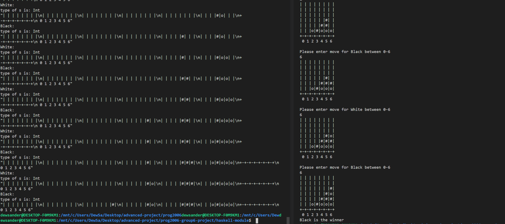

## Authors: Alexander Eckhoff Larsen & Sander Fuhr

### Gameplay and mechanics
The game is a 4 in a row/connect 4 type game where the aim is to connect four markers either vertically, horizontally or diagonally. The two players take turns at placing their markers on the board

### Implementation
The game is implemented in Haskell, using a rust program as an interface between the two programs through ZMQ. 
The Haskell implementation is inspired and based upon Maysam Torabi's opensource project: https://github.com/maysam/connect-four-haskell

## Building / Running
This game consists of a Rust and Haskell program which both needs to be running. First start the Rust program by cd-ing to the root of the rust-module and then do as described below

```shell
cargo run
```

Then cd to the root of the Haskell module and do 'stack run' from there

```shell
stack run
```

From the Rust program you will be able to select positions from 0-6 to place a marker.

If a position is entered too fast or out of range, you will be prompted to enter again.

Tests are implemented using doctests. 

```shell
stack test
```


Example run of program:

Left: Haskell

Right: Rust



